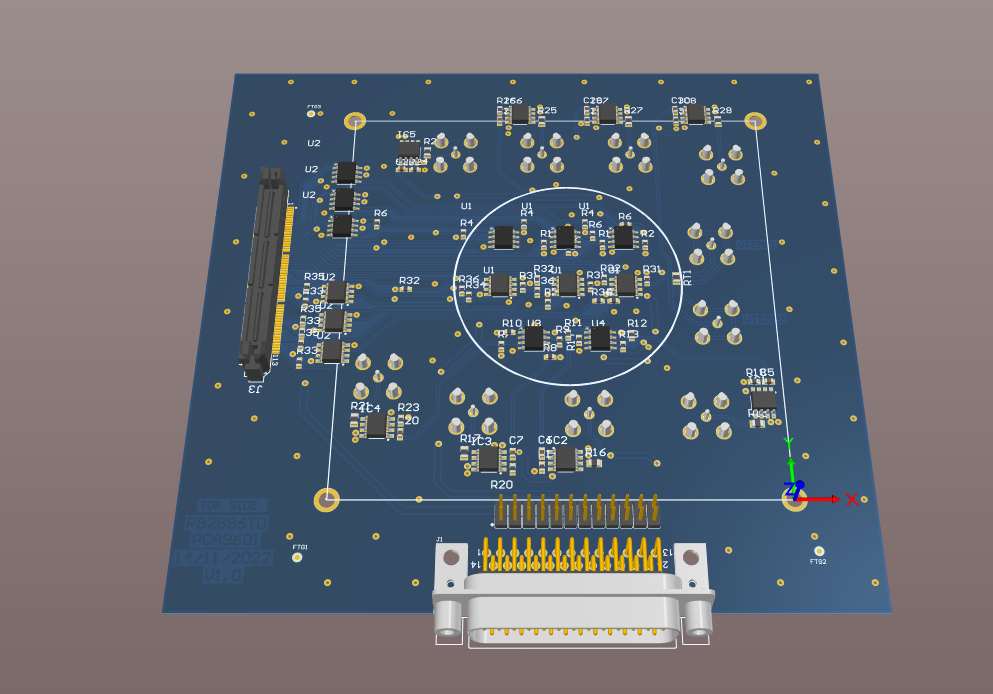
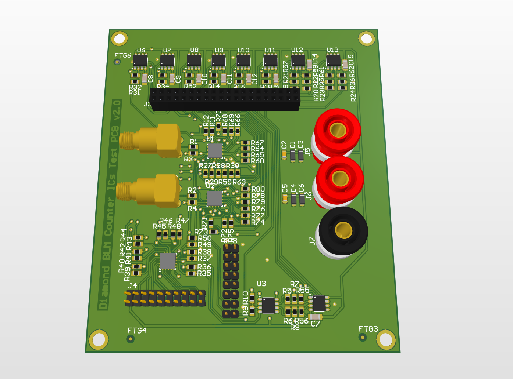
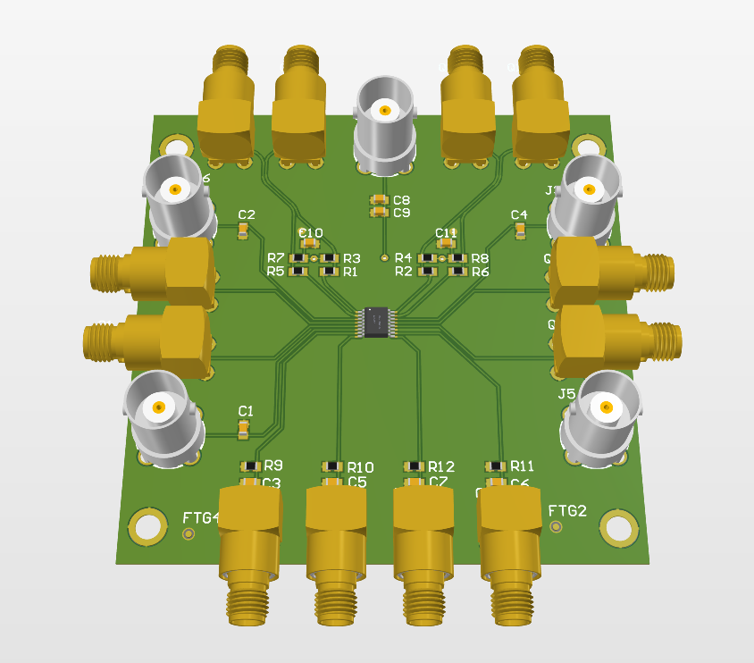

# PCB-Designs

Here there are some of the PCBs that I designed, soldered and tested for testing components under radiation during my 1-year internship at CERN, in the BE-CEM-EPR section.

### 1. I2C Transceivers Testing 

### 2. Diamond BLM Data Aqcuisition PCB - System Level Testing 

### 3. High Speed Comparator - Component Level Testing 

